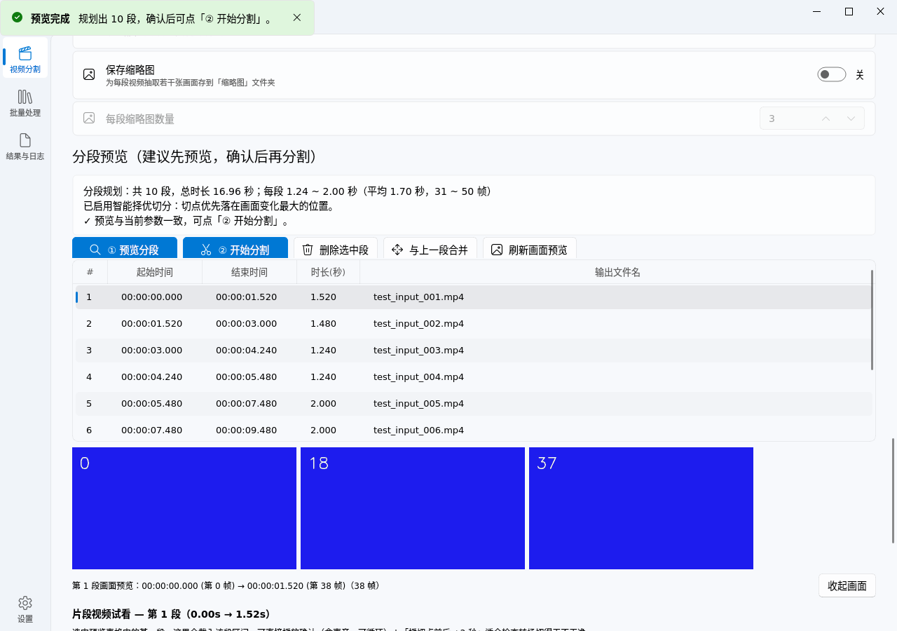
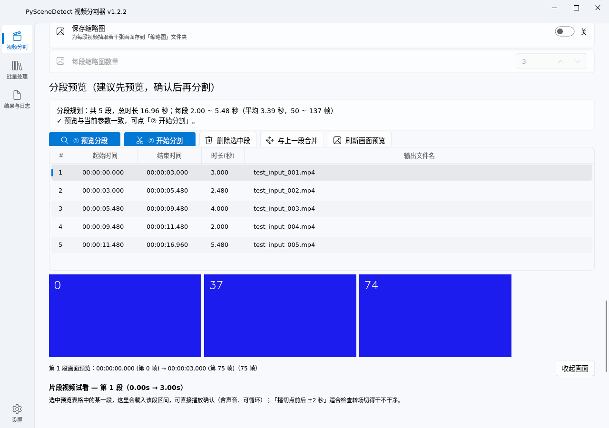
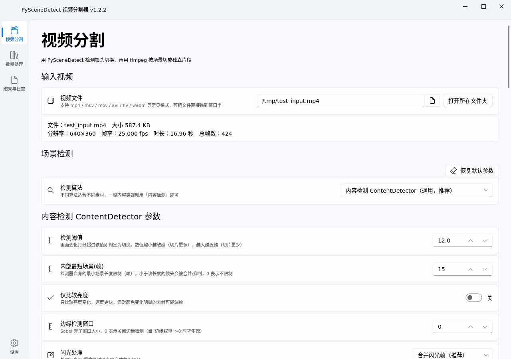
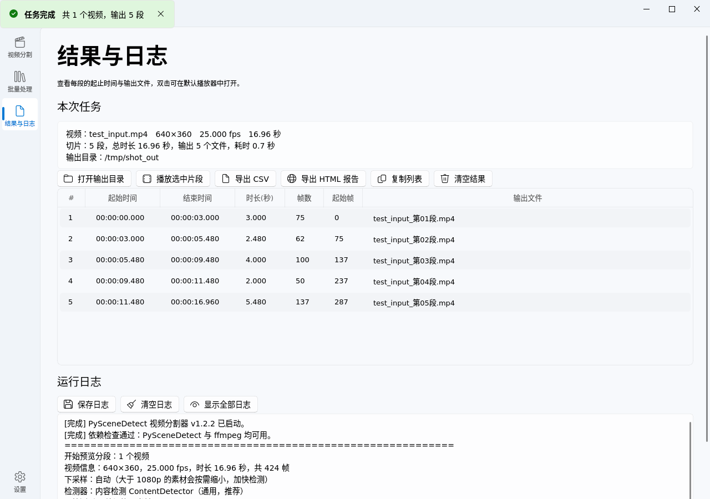
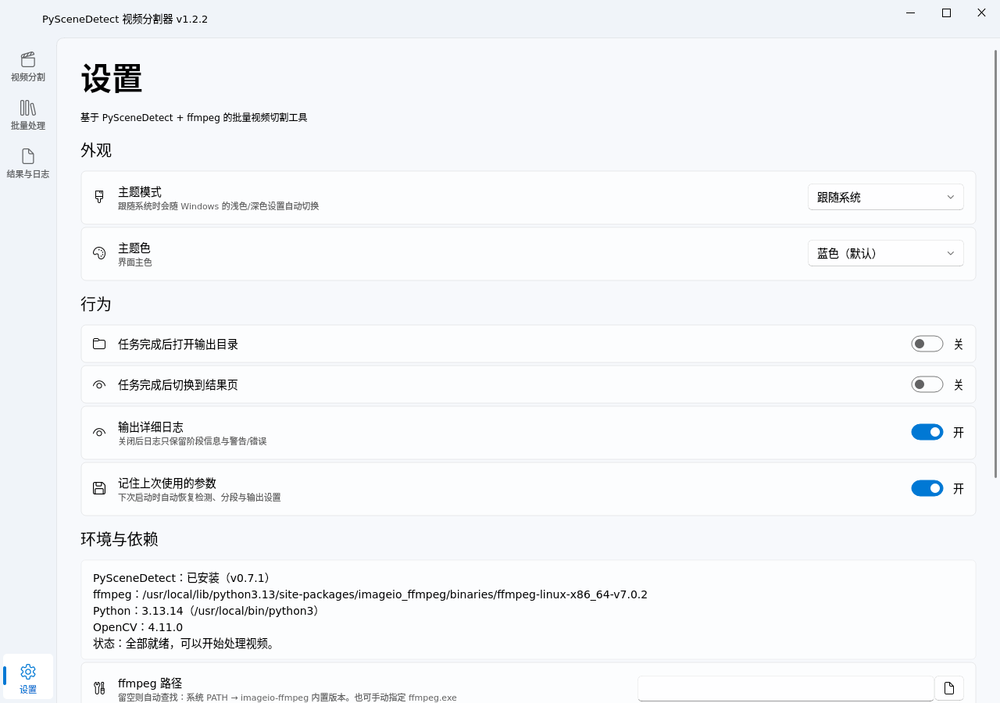
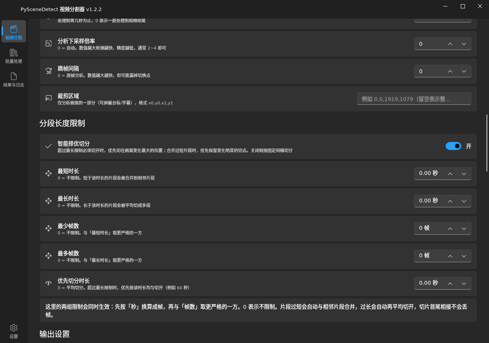

# PySceneDetect 视频分割器

一个面向 Windows 的中文图形界面小工具：用 **PySceneDetect** 检测镜头切换，再用 **ffmpeg** 把视频按场景切成一个个独立片段。

界面基于 **PySide6 + PySide6-Fluent-Widgets**（Win11 Fluent Design 风格），可跟随系统浅色/深色主题。

| 预览分段（先看清楚会切成什么样） | 预览中的画面确认 |
| --- | --- |
|  |  |

| 视频分割页 | 结果与日志页 |
| --- | --- |
|  |  |

| 设置页 | 深色主题 |
| --- | --- |
|  |  |

> 文档地图：[ARCHITECTURE](ARCHITECTURE.md)（结构）· [CONTRIBUTING](CONTRIBUTING.md)（开发/测试/发版）· [TROUBLESHOOTING](TROUBLESHOOTING.md)（常见问题）· [CHANGELOG](CHANGELOG.md)（版本历史）

---

## 一、功能一览

| 分类 | 能力 |
| --- | --- |
| 场景检测 | 内容检测 / 自适应检测 / 阈值检测（黑场·淡入淡出）/ 感知哈希 / 直方图，共 5 种算法，参数全部可调 |
| 分段长度限制 | **最短时长（秒）**、**最长时长（秒）**、**最少帧数**、**最多帧数**，四者可同时生效；**智能择优**：超长切分/过短合并时优先保留画面变化最大的切点 |
| 处理范围 | 起始时间、结束时间、分析下采样倍率、跳帧间隔、画面裁剪区域 |
| 输出 | 自定义文件名模板与序号位数、MP4/MKV/MOV、不重编码（快）/ 重编码 H.264（精确到帧）、CRF 画质、编码速度预设、音频复制或转 AAC、附加 ffmpeg 参数、覆盖同名文件开关 |
| 报告 | CSV 场景列表（UTF-8 BOM，Excel 直接打开不乱码）、带缩略图的 HTML 报告、缩略图批量导出 |
| 工作流 | **先预览分段 → 确认/微调 → 再真正分割**；参数一改自动提示重新预览，杜绝“切完才发现不对” |
| 其它 | 批量处理（多文件 / 整个文件夹递归）、拖拽添加文件、日志页、任务可随时停止、参数自动记忆、浅色/深色主题与主题色 |

---

## 二、快速开始（Windows）

> 只想快点用起来：装好 Python 后依次双击 **`安装依赖.bat`** → **`启动.bat`** 即可（详见同目录 `使用说明.txt`）。

### 方式 A：源码运行（推荐先试这个）

1. 安装 **Python 3.9 及以上（实测至 3.14）**（[python.org](https://www.python.org/downloads/windows/)），安装时**务必勾选 “Add python.exe to PATH”**。
2. 双击 **`安装依赖.bat`**（会用系统 Python 安装下表依赖，如 pip 慢可换国内镜像）。
3. 双击 **`启动.bat`** 运行程序。

> 依赖清单（`requirements.txt`）：
> `PySide6`、`PySide6-Fluent-Widgets`、`scenedetect`、`imageio-ffmpeg`

> **项目虚拟环境（`.venv`，推荐）**：`安装依赖.bat` 在没有 `.venv` 时会询问是否创建（直接回车即创建，需约一分钟）；
> 一旦存在，`启动.bat` / `调试启动.bat` / `诊断.bat` / `build_exe.bat` 都会优先使用 `.venv` 里的 Python，
> 依赖装在项目目录内，不污染系统 Python。删除 `.venv` 文件夹即回到系统 Python 模式。
> 若创建失败会询问是否改用系统 Python（默认取消）；损坏、重建等问题见 [TROUBLESHOOTING](TROUBLESHOOTING.md)。

**启动.bat 窗口一闪而过？** 先双击 **`诊断.bat`** 看环境哪里不对；想看详细报错就用 **`调试启动.bat`**（会保留控制台）。
也可以用 `python main.py` 直接运行——功能等价，但直接运行会保留命令行窗口，方便看实时日志；启动脚本多做了「依赖自检 + 使用 pythonw 隐藏控制台」。双击 `.bat` 时短暂出现的黑框是批处理宿主本身，随后会自动退出。

`imageio-ffmpeg` 会自带一份 ffmpeg 可执行文件，所以**不需要**手动配置 ffmpeg 就能切割。
如果你机器上已有 ffmpeg，程序会优先用 PATH 里的版本；也可以到「设置 → 环境与依赖」手动指定路径。

### 方式 B：打包成免安装 EXE

双击 **`build_exe.bat`**，完成后可执行文件在 `dist\PySceneDetect视频分割器\` 目录里，**把整个目录拷走**即可在其他 Windows 电脑运行（已内置 ffmpeg 与 Qt 运行库）。

### 其它平台（Linux / macOS）

代码无平台硬编码（平台分支很少且全 guarded，全回归在 Linux 通过），用法与 Windows 对等，
只是 `.bat` 为 Windows 专用，Linux/macOS 用下面三行代替（效果等价于 安装依赖.bat + 启动.bat）：

```bash
python3 -m venv .venv
.venv/bin/pip install -r requirements.txt
.venv/bin/python main.py
```

最小化系统若报缺 `.so`（如 `libxkbcommon`），按缺失名用包管理器补装即可，
Debian/Ubuntu 参考：`sudo apt install libxkbcommon0 libpulse0`
（`libpulse0` 仅内嵌试看播放需要，缺了会自动降级为提示文字 + 外部播放，不影响切割）。

---

## 三、界面说明

左侧导航共四页：

1. **视频分割** —— 主工作页，推荐流程是：
   ① 选视频 → ② 选检测算法与分段限制 → ③ 点「**① 预览分段**」（只做检测，不产生文件）→
   ④ 在预览表格里逐段确认，可「删除选中段」「与上一段合并」，选中某段能看到该段的**首/中/尾画面**，
   还能在内嵌播放器里**直接播放该段视频**（含声音、可循环、可拖进度），或一键用外部播放器试看 →
   ⑤ 满意后点「**② 开始分割**」，输出的就是刚才预览的那一份；不满意直接改参数，程序会提示「需要重新预览」。
   想只要报告不要视频，点「仅检测并导出报告」（会真实生成 CSV / HTML 文件）。参数调乱了点「场景检测」组右上角的「恢复默认参数」一键回去。
2. **批量处理** —— 一次处理多个视频或整个文件夹（可递归子文件夹、可为每个视频单独建输出子文件夹）。检测与分段参数共用「视频分割」页的设置。
3. **结果与日志** —— 每段的起止时间、时长、帧数、输出文件名；双击某行可用默认播放器打开该片段；可导出 CSV / HTML、复制列表、保存日志。
4. **设置** —— 主题模式与主题色、完成后的行为、ffmpeg 路径、**一键安装 / 更新依赖**、恢复默认参数、恢复出厂设置、关于信息。

小技巧：把视频文件直接**拖进窗口**即可载入；拖入文件夹会自动加到批量处理页。

---

## 四、预览 → 确认 → 分割（工作流说明）

这是为了避免“切完了才发现参数不合适”，整个流程分两步：

| 步骤 | 做了什么 | 会产生文件吗 |
| --- | --- | --- |
| ① 预览分段 | 只做场景检测 + 分段整理，把最终会切成的每一段列出来 | **不会**（不切视频、不写报告） |
| ② 开始分割 | 按你确认过的段列表逐个调用 ffmpeg 切割 | 会（视频 + 报告） |

预览面板提供的信息：

- **分段列表**：序号、起始/结束时间（精确到毫秒）、时长(秒)、**该段将使用的输出文件名**；
- **统计与自检**：段数、总时长、每段时长与帧数的区间和平均值；如果某些段短于/长于你设定的限制，会明确提示是哪几条；
- **画面预览**：选中某一行，右侧显示这一段的**首 / 中 / 尾**三张画面，用来判断切点是否切到了想切的位置（例如有没有切在字幕中间、有没有漏掉一小段）；画面区可随时收起（「收起画面」按钮，状态自动记住）。
- **视频试看**：选中某一行，内嵌播放器会载入该段区间，可播放 / 循环 / 点按或拖进度（含声音），还能「播切点前后 ±2 秒」检查转场；
  「只播本段」两侧的「上一段 / 下一段」可快速换段（在播时新段接着播）；
  遇到内嵌播不了的格式，点「外部播放器试看」，程序会用 ffmpeg 秒级截取该段为临时文件，再用系统默认播放器打开（所见即所得）；
- **手动微调**：「删除选中段」（这一段不要了，空档会在提示里标出）、「与上一段合并」（把两段合成一段）。播放器下方也有「删除本段 / 与上一段合并」（看完即点）；快捷键 Delete 删除选中段、M 合并。

其它细节：

- 改了**影响分段**的参数（检测器、阈值、时长/帧数限制、起止时间、下采样、跳帧、裁剪）→ 面板立刻提示“参数已修改，请重新预览”，并且「② 开始分割」会被禁用，防止用旧规划切出新结果；
- 改**不影响分段**的参数（编码方式、CRF、文件名模板、CSV/HTML 选项等）→ 预览依然有效，可以直接分割；
- 预览结果会一直保留，分割完成后还能接着调参数、重新预览、再切一次（配合「覆盖同名文件」开关使用）；
- 批量处理页不走预览流程（文件太多不便于逐个确认），参数直接复用「视频分割」页的设置。

---

## 五、参数详解

### 1. 分段长度限制（本工具最核心的一组参数）

四组限制会**同时生效**，逻辑如下：

1. 先按视频帧率把「最短/最长时长(秒)」换算成帧数，再与「最少/最多帧数」**取更严格的一方**；
   （例：3.5 秒 @25fps = 87 帧，若「最多帧数」填了 60，则最终上限是 60 帧）
2. 检测出的场景若**短于下限**，会与相邻场景**合并**；
3. 若**长于上限**，会在片段内**平均切开**成多段（「优先切分时长」填了非 0 值时，会尽量按该时长均匀切）；
4. 所有切片**首尾相接、不丢帧**，最后一段不会被裁掉尾巴；
5. 填 `0` 表示该项不限制；
6. 当「最短」与「最长」互相矛盾（例如都填 60 帧）时，**优先保证最短/最少**——即宁可某段略微超过上限，也不会切出一堆不达标的短片段。
7. **智能择优切分**（默认开启）：检测时会顺手记录整条视频的画面变化曲线；合并过短片段时，用动态规划保留置信度和最高的切点；
   超过最长限制必须切开时，每刀会吸附到附近画面变化最大的峰值上（仍严格满足最长/最短限制；纯静态内容无峰可吸时回退均匀切分）。
   关闭后回到老式固定间隔切分。

> 说明：这一步是在检测结果之上的**二次整理**，所以「切片数量」可能与「检测到的切点数」不同。

### 2. 检测算法参数

**内容检测 ContentDetector**（通用首选）

| 参数 | 说明 |
| --- | --- |
| 检测阈值 | 画面变化打分超过该值即判定为切换。越小越敏感（切得更多），常用 20~35 |
| 内部最短场景(帧) | 检测器自身的最小场景限制（帧），小于该长度的镜头会被合并/抑制 |
| 仅比较亮度 | 只比较亮度，速度更快，但对颜色变化明显的素材可能漏检 |
| 边缘检测窗口 | Sobel 窗口大小，0 表示关闭（需与「边缘权重」配合） |
| 闪光处理 | `合并闪光帧`（推荐）/ `抑制短镜头`，用于处理闪光灯、爆炸等瞬时亮暗 |
| 亮度 / 色相 / 饱和度 / 边缘权重 | 各分量在打分中的权重，边缘权重默认 0 |

**自适应检测 AdaptiveDetector**：适合有手持晃动、镜头运动的素材。
额外参数：自适应阈值（默认 3.0，越小越敏感）、参考窗口(帧)（默认 2）、最低内容得分（默认 15，用于抑制噪点抖动）。

**阈值检测 ThresholdDetector**：适合**黑场、淡入淡出**转场。
额外参数：亮度阈值、淡入淡出偏置（正数后移切换点、负数前移）、补全末尾场景、检测方式（亮于阈值 floor / 暗于阈值 ceiling）。

**感知哈希 HashDetector**：速度快、抗噪，适合批量粗切。参数：感知哈希阈值（默认 0.395）、哈希尺寸（16）、低通滤波强度（2）。

**直方图检测 HistogramDetector**：比较颜色分布变化。参数：直方图差异阈值（默认 0.05）、直方图柱数（256）。

> 各检测器都有「内部最短场景(帧)」参数：默认 15。填 0 表示不限制——**想尽可能多地切分时，可以把它设为 0 或 1**。

### 3. 处理范围

| 参数 | 说明 |
| --- | --- |
| 起始时间 / 结束时间 | 只处理视频中某一段（秒），0 表示不限 |
| 分析下采样倍率 | 0 = 自动。数值越大检测越快、精度越低（1080p 素材用 2~4 通常够用） |
| 跳帧间隔 | 0 = 逐帧分析。数值越大越快，但可能漏掉切换点 |
| 裁剪区域 | `x0,y0,x1,y1`，只分析画面局部（可屏蔽台标、字幕区） |

### 4. 输出设置

| 参数 | 说明 |
| --- | --- |
| 输出目录 | 留空 = 保存到源视频所在目录 |
| 文件名模板 | 见下表变量 |
| 起始序号 / 序号位数 | 例如起始 1、位数 3 → `001` |
| 封装格式 | MP4 / MKV（可保留多音轨与字幕）/ MOV |
| 编码方式 | **不重编码**：极快，但切片起点会对齐到最近的关键帧（细节略有出入）；**重编码 H.264**：按场景的半开帧区间精确输出，速度取决于 CPU |
| 画质 CRF | 越小画质越好、文件越大，常用 18~28 |
| 编码速度预设 | ultrafast ~ veryslow，越靠后压缩率越高、越慢 |
| 音频处理 | 复制原音轨（最快）/ 转为 AAC / 去除音轨 |
| 附加 ffmpeg 参数 | 高级用法，原样追加，如 `-vf scale=1280:-2` |

> 想把切出来的段再拼回原片：视频必须「重编码 H.264」（帧精确，这是前提）；
> 音频能去则「去音轨」（零误差），要留声则「转 AAC」（基本一致，几十毫秒级误差）；
> 不重编码时每段开头会多带关键帧之前的帧，光转音频治不了视频（详见 [TROUBLESHOOTING](TROUBLESHOOTING.md)）。

**文件名模板变量**

| 变量 | 含义 | 示例 |
| --- | --- | --- |
| `$VIDEO_NAME` | 源视频文件名（不含扩展名） | `旅行记录` |
| `$SCENE_NUMBER` | 片段序号（受「序号位数」控制） | `007` |
| `$START_TIME` / `$END_TIME` | 起止时间 | `00-03-24-480` |
| `$DURATION` | 该段时长 | `00-00-05-200` |
| `$START_FRAME` / `$END_FRAME` | 起止帧号 | `0` / `130` |
| `$DATE` | 当前日期 | `20250912` |

示例：`$VIDEO_NAME_第$SCENE_NUMBER段` → `旅行记录_第007段.mp4`

---

## 六、常见问题

已移至 [TROUBLESHOOTING.md](TROUBLESHOOTING.md)：启动一闪而过、ffmpeg 缺失、切分数量不对、
无损切割帧偏移、杀软误报、播放器黑屏、参数恢复等；诊断流程与提 Issue 清单也在里面。

---

## 七、项目结构（开发者）

已移至 [ARCHITECTURE.md](ARCHITECTURE.md)（模块关系、数据流、线程模型、关键决策）；
环境搭建、测试、打包发版与 `core` 二次开发示例见 [CONTRIBUTING.md](CONTRIBUTING.md)。

---

## 八、兼容性说明

- **PySceneDetect 0.6.x / 0.7.x 均可**：代码对不同版本的回调签名、`FlashFilter`、`FrameTimecode` API 做了兼容处理；
  并重写了内部逐帧方法，保证长视频也能实时刷新进度、随时取消（个别版本不受支持时会自动退回原生行为，仅进度刷新变粗）。
- **PySide6-Fluent-Widgets** 使用 1.x 公共 API（`SettingCardGroup`、`InfoBar`、`MSFluentWindow` 等）。
- Windows 10 / 11 下会自动隐藏 ffmpeg 子进程的黑色控制台窗口。

## 九、许可与致谢

本项目代码采用 [MIT License](LICENSE) 开源。

本工具为图形界面前端封装，仅做批量切割与报告整理。
- 场景检测：[PySceneDetect](https://www.scenedetect.com/)（BSD-3-Clause，© Brandon Castellano）
- 视频处理：[ffmpeg](https://ffmpeg.org/)（LGPL / GPL）
- 界面库：[PySide6](https://www.qt.io/) + [PySide6-Fluent-Widgets](https://qfluentwidgets.com/)（MIT）

请仅处理你有权使用的视频，并遵守当地法律与版权规定。
